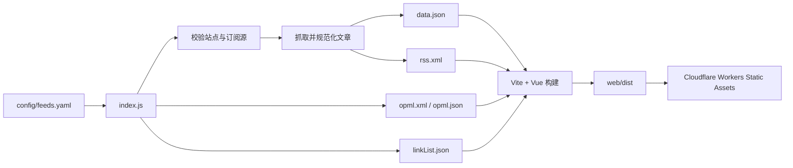

# BlogRoll Worker

[](https://github.com/Overbye/BlogRoll-Worker/actions/workflows/deploy.yml)
[](https://workers.cloudflare.com/)
[](https://vuejs.org/)
[](./LICENSE)

一个运行在 Cloudflare Workers 上的自动化博客聚合服务。项目定时抓取 RSS/Atom 订阅源，生成统一的文章列表、聚合 RSS 和 OPML，并通过 Vue 提供轻量级浏览界面。

- 在线站点：[blogroll.axz.me](https://blogroll.axz.me/)
- 聚合 RSS：[blogroll.axz.me/rss.xml](https://blogroll.axz.me/rss.xml)
- OPML 列表：[blogroll.axz.me/opml.xml](https://blogroll.axz.me/opml.xml)
- Worker 地址：[blogroll.overbye.workers.dev](https://blogroll.overbye.workers.dev/)

## 项目概览

BlogRoll Worker 将订阅管理、Feed 聚合、前端构建和边缘部署整合为一条自动化流水线。订阅源统一维护在 [`config/feeds.yaml`](./config/feeds.yaml)；配置提交到 `main` 后，GitHub Actions 会重新生成数据并部署到 Cloudflare。

主要能力：

- 聚合 RSS 2.0、Atom 等常见 XML Feed。
- 自动生成网页文章数据、聚合 RSS、OPML 和站点清单。
- 隔离网络超时、限流、无效 XML 和异常文章。
- 限制抓取并发，并对临时网络错误进行有限重试。
- 在加载阶段校验订阅配置，阻止错误或重复配置进入部署流程。
- 通过 GitHub Actions 定时生成并部署到 Cloudflare Workers Static Assets。

## 工作原理



| 触发方式 | 条件 | 用途 |
| --- | --- | --- |
| 分支推送 | 推送或合并到 `main` | 订阅或代码变更后立即部署 |
| 定时任务 | 每天 `04:17`、`16:17` UTC | 自动刷新文章内容 |
| 手动运行 | GitHub Actions 的 `Run workflow` | 发布验证或故障恢复 |

## 快速开始

### 环境要求

- Node.js 24
- npm 11，或与锁文件兼容的 npm 版本
- 仅在部署时需要 Cloudflare 账户和 Wrangler 登录状态

### 本地运行

```bash
git clone https://github.com/Overbye/BlogRoll-Worker.git
cd BlogRoll-Worker
npm ci
npm run gen
npm run dev
```

### 构建与预览

```bash
npm run gen
npm run build
npm run preview
```

预览服务默认监听 `5050` 端口，生产构建结果位于 `web/dist/`。

## 管理订阅源

以后所有订阅源都在 [`config/feeds.yaml`](./config/feeds.yaml) 中更新和维护。README 不再保存或解析订阅列表。

### 添加订阅

在 `feeds` 数组中增加一项：

```yaml
- title: "示例博客"
  htmlUrl: "https://example.com"
  description: "示例描述"
  avatarUrl: "https://example.com/avatar.png"
  xmlUrl: "https://example.com/feed.xml"
  category: "技术"
```

| 字段 | 必填 | 说明 |
| --- | --- | --- |
| `title` | 是 | 站点显示名称，也是文章来源名称；不可重复 |
| `htmlUrl` | 是 | 站点首页，必须是完整的 HTTP(S) URL |
| `description` | 否 | 站点简介；无内容时填写空字符串 |
| `avatarUrl` | 否 | 头像地址；留空时尝试使用网站的 `/favicon.ico` |
| `xmlUrl` | 否 | RSS/Atom 地址；留空时尝试使用网站的 `/feed`；非空时不可重复 |
| `category` | 否 | 前端分组名称；留空时进入默认分组 |

顶层 `version` 是配置格式版本，当前必须保持为 `1`。推荐使用引号包裹文本和 URL，避免 YAML 将特殊字符解释为其他数据类型。

### 修改或删除订阅

- 修改：找到对应 `title`，更新所需字段。
- 删除：完整删除该订阅项，包括从 `- title` 开始的全部字段。
- 排序：可以调整条目顺序，不影响文章按发布时间排序。

修改后执行：

```bash
npm run gen
npm run build
```

配置文件存在缺失字段、无效 URL 或重复项时，`npm run gen` 会直接失败并指出对应条目。单个上游站点暂时失效不会中断全部生成过程；该站点会被标记为 `lost`，其他可用订阅仍会继续处理。

## 部署到 Cloudflare

### GitHub Actions 自动部署

1. Fork 本仓库，并在 Cloudflare 创建或选择 Workers 账户。
2. 创建允许部署 Workers 的 Cloudflare API Token。
3. 在仓库的 `Settings → Secrets and variables → Actions` 中添加 `CF_WORKERS_TOKEN`。
4. 按需修改 [`wrangler.toml`](./wrangler.toml) 中的 Worker 名称、账户和域名配置。
5. 提交到 `main`，或在 `Actions → Deploy` 中选择 `Run workflow`。

不要将 API Token 写入 `wrangler.toml` 或提交到仓库。自定义域名建议在 Cloudflare Dashboard 的 Worker 设置中绑定。

> [!NOTE]
> GitHub 可能停用长期无活动的公开仓库定时任务。如果定时更新停止，请在 `Actions → Deploy` 中重新启用工作流并手动运行一次。

### 本地部署

```bash
npm ci
npm run gen
npm run build
npx wrangler@4 login
npx wrangler@4 deploy
```

部署前可以执行 `npx wrangler@4 deploy --dry-run` 检查构建产物和 Workers 配置。

## 配置参考

### 聚合配置

以下选项位于 [`index.js`](./index.js)：

| 配置 | 默认值 | 说明 |
| --- | --- | --- |
| `opmlXmlContentTitle` | `idealclover Blogroll` | OPML 文档标题 |
| `maxDataJsonItemsNumberForWeb` | `120` | 网页最多保留的文章数 |
| `maxDataJsonItemsNumberForRSS` | `40` | 聚合 RSS 最多保留的文章数 |
| `feed.title` | `Another RSS Reader` | 聚合 RSS 标题 |
| `feed.feed_url` | `https://blogroll.axz.me/rss.xml` | 聚合 RSS 的公开地址 |
| `feed.site_url` | `https://blogroll.axz.me/` | 站点公开地址 |

Fork 后应按自己的域名和站点信息调整 `feed` 配置。

### Worker 配置

以下选项位于 [`wrangler.toml`](./wrangler.toml)：

| 配置 | 说明 |
| --- | --- |
| `name` | Worker 服务名称 |
| `account_id` | Cloudflare 账户 ID |
| `workers_dev` | 是否提供 `workers.dev` 地址 |
| `compatibility_date` | Workers 运行时兼容日期 |
| `assets.directory` | Vite 生产构建目录 |
| `assets.not_found_handling` | 单页应用路由回退策略 |
| `observability.logs.enabled` | 是否启用 Worker 日志 |

安全响应头定义在 [`web/public/_headers`](./web/public/_headers)，构建时会复制到静态资源目录。

## 生成产物

生成文件不提交到 Git，由 CI 在每次部署时重新创建。

| 文件 | 消费方 | 内容 |
| --- | --- | --- |
| `web/src/assets/data.json` | Vue 前端 | 规范化后的文章列表 |
| `web/src/assets/opml.json` | Vue 前端 | 订阅源元数据 |
| `web/public/rss.xml` | RSS 客户端 | 聚合 RSS Feed |
| `web/public/opml.xml` | RSS 客户端 | 可导入的 OPML 文件 |
| `web/public/linkList.json` | Vue 前端 | 按分类和可用状态组织的站点清单 |
| `web/dist/` | Cloudflare Workers | Vite 生产构建结果 |

## 项目结构

```text
BlogRoll-Worker/
├── .github/workflows/deploy.yml  # 自动生成与部署工作流
├── config/
│   └── feeds.yaml                # 唯一的订阅源配置文件
├── web/
│   ├── public/                   # 公开静态文件与生成产物
│   ├── src/                      # Vue 应用源码
│   └── vite.config.js            # Vite 配置
├── index.js                      # Feed 校验、抓取、解析与聚合
├── package.json                  # 项目脚本和依赖
├── wrangler.toml                 # Cloudflare Worker 配置
└── README.md                     # 项目使用与维护文档
```

## 可用命令

| 命令 | 说明 |
| --- | --- |
| `npm run dev` | 启动 Vite 开发服务器 |
| `npm run gen` | 校验并抓取订阅源，生成 JSON、RSS 和 OPML |
| `npm run build` | 构建生产站点 |
| `npm run preview` | 在 `5050` 端口预览生产构建 |

## 故障排查

| 现象 | 常见原因 | 处理方式 |
| --- | --- | --- |
| `feeds.yaml` 校验失败 | 字段缺失、URL 无效或配置重复 | 根据报错序号修正对应订阅项 |
| 个别站点显示 `lost` | 超时、DNS、TLS、403/429 或上游停机 | 检查站点和 Feed URL；必要时更换稳定代理源 |
| `npm run gen` 没有文章 | Feed 地址无效、返回 HTML 或 XML 不规范 | 单独访问 Feed，确认响应内容和发布时间字段 |
| GitHub Actions 不再定时运行 | 工作流被停用或仓库长期无活动 | 在 Actions 页面重新启用并手动运行一次 |
| Cloudflare 部署认证失败 | Token 失效、权限不足或 Secret 名称错误 | 更新 `CF_WORKERS_TOKEN` 并确认 Workers 写权限 |
| 自定义域名仍显示旧内容 | 域名未绑定当前 Worker 或缓存尚未刷新 | 检查 Worker 自定义域名和路由配置 |
| 构建成功但页面无内容 | 未先运行生成任务 | 依次执行 `npm run gen` 和 `npm run build` |

## 贡献指南

欢迎提交订阅源修正、兼容性改进和前端优化。

1. Fork 仓库并创建功能分支。
2. 修改代码或 [`config/feeds.yaml`](./config/feeds.yaml)。
3. 执行 `npm run gen` 和 `npm run build`。
4. 确认没有提交生成目录、Token 或其他敏感信息。
5. 创建 Pull Request，并说明变更目的和验证结果。

提交订阅源时，请优先使用站点官方 RSS/Atom 地址，并避免提交需要身份验证或包含私人内容的 Feed。

## 许可证与致谢

本项目基于 [NJU-LUG/Blogroll](https://github.com/nju-lug/blogroll) 和 [Friend-Link-House](https://github.com/idealclover/Friend-Link-House) 的工作演进而来，并采用 [MIT License](./LICENSE) 开源。
